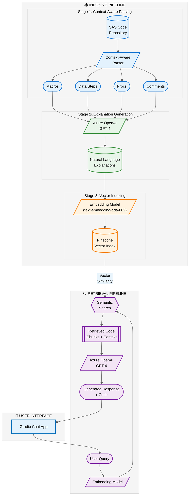

# Smarter SAS Code Retrieval: A Context-Aware RAG Approach for Clinical Programming

> Leveraging LLMs to unlock institutional knowledge in clinical SAS repositories

---

## The Problem

In recent conversations with my clinical programming peers, a recurring theme has emerged: **how can clinical programming teams leverage Large Language Models (LLMs) to generate code that draws from their internal SAS repositories?**

For pharmaceutical and biotech companies, these repositories represent decades of refined programming expertise—SDTM and ADaM derivation logic, company-specific macros for CDISC compliance, validated transformation patterns, and hard-won knowledge about handling edge cases in clinical trial data.

This institutional knowledge is genuine intellectual property. A macro that correctly derives EPOCH from the SE domain, or a DATA step that handles all the nuances of calculating study day variables—these represent thousands of hours of development and validation work.

**RAG (Retrieval-Augmented Generation)** seems like the natural answer. But when we started exploring this approach for clinical SAS code, we encountered two fundamental challenges.

---

## Challenge 1: The Chunking Problem

Traditional RAG implementations chunk documents based on character or word count—say, 500 tokens per chunk. This works for prose, but **clinical SAS code is different**.

A fixed-length chunking strategy can:
- Split a macro definition across multiple chunks
- Separate a DATA step from its related PROC SORT
- Fragment the derivation logic that gives code its meaning

**Example:** A programmer asks *"How do I derive the DM domain from raw data?"* A naive chunking approach might return the middle portion of a demographics derivation—missing the `LENGTH` statement that defines `USUBJID`, or cutting off the critical `AGE` calculation logic.

Clinical programming macros are particularly vulnerable. A utility macro like `%xuvisit` that derives `VISIT` and `VISITNUM` might span 80+ lines. Splitting it arbitrarily destroys the parameter validation logic, merge sequence, and unscheduled visit handling.

---

## Challenge 2: The Semantic Gap

Even with perfect chunking, there's a deeper problem.

When a clinical programmer asks:
> *"How do I calculate study day variables accounting for the reference start date?"*

We're expecting their natural language query to match against raw SAS code containing variables like `RFSTDTC`, `--DY`, and `INTCK` function calls.

The semantic similarity between plain English and clinical SAS code with CDISC variable names is **tenuous at best**. Relevant code chunks often rank poorly in retrieval.

---

## Our Solution: Three-Stage Pipeline

We developed a solution that addresses both challenges through a pipeline designed specifically for clinical SAS code.

### Stage 1: Context-Aware Code Parsing

Instead of arbitrary chunking, we built a parser that understands SAS code structure using regex patterns tuned for SAS syntax:

- **Macros**: Complete definitions from `%macro` to `%mend`
- **DATA steps**: From `data` to `run;`
- **PROC blocks**: Full procedures
- **Comments**: Associated documentation

When we parse a clinical macro like `%xusupp`, we get the entire definition as a single retrievable unit—nothing is fragmented.

### Stage 2: LLM-Generated Explanations

Rather than embedding raw code, we feed each chunk (with full file context) to an LLM and ask for a natural language explanation:

> **Example:** A DATA step that creates the DM domain gets an explanation like:
> 
> *"This DATA step creates the Demographics (DM) domain dataset, constructing USUBJID by concatenating STUDYID, SITEID, and subject number, calculating AGE from BRTHDTC and reference date using the INTCK function with month-boundary adjustment, deriving age treatment groups (ATRT), and mapping race categories to standardized numeric codes."*

These clinical-context explanations become our **embedding targets**. We're now comparing natural language queries against natural language descriptions.

### Stage 3: Vector Indexing and Retrieval

The explanations are embedded using Azure OpenAI's embedding model and stored in Pinecone with rich metadata:

- Original code
- Source filename
- Line numbers
- Chunk type

When a programmer asks a question, we retrieve semantically similar explanations and return the associated code chunks as context for generation.

---

## Architecture




## Code Chunk Schema

Each parsed chunk is stored with the following structure:

```json
{
  "chunk_type": "macro | data_step | proc",
  "name": "identifier or null",
  "code": "complete SAS code block",
  "comments": "associated comments",
  "explanation": "LLM-generated natural language description",
  "filename": "source file name",
  "filepath": "full path to source file",
  "line_start": 27,
  "line_end": 57
}
```

---

## Example: Parsed Chunks

### Macro Example

**Source:** `autoexec.sas` (Lines 27-57)

```sas
%macro init;
  %global __root II __sponsor_level __prod_qc_separation;
  
  %if &sysscp=WIN %then %do;
    %let __root = F:\projects;
    %let II = \;
  %end;
  %else %if &sysscp in (SUN 4, SUN 64, LIN X64) %then %do;
    %let __root = /sambaShare/projects;
    %let II = /;
  %end;
%mend init;
```

**LLM Explanation:** *Initializes environment-specific settings and global variables for SAS programs. Determines root directory path and directory separator based on the operating system.*

---

### DATA Step Example

**Source:** `d0_dm.sas` (Lines 22-52)

```sas
data dm;
  set &rawdata..dm(drop=race);
  
  usubjid = trim(left(studyid))||'-'||
            trim(left(site))||'-'||
            trim(left(randomno));
  
  age = round((intck('month',brthdtn,dmdtn) - 
        (day(dmdtn) < day(brthdtn))) / 12, .1);
  ageu = 'Years';
run;
```

**LLM Explanation:** *Creates the SDTM Demographics (DM) domain dataset. Constructs USUBJID from STUDYID, site, and randomization number. Calculates AGE using INTCK with month-boundary adjustment.*

---

## Tech Stack

| Component | Technology |
|-----------|------------|
| LLM | Azure OpenAI (GPT-4) |
| Embeddings | text-embedding-ada-002 |
| Vector Store | Pinecone |
| Chat Interface | Gradio |
| Language | Python |

---

## Sample Queries

The clinical programming assistant can answer questions like:

- *"How do I derive EPOCH using the SE domain?"*
- *"Show me how to calculate SDTM DY variables"*
- *"How can I create an Adverse Events summary by SOC and Preferred Term?"*
- *"What's our standard approach for USUBJID construction?"*

---

## Why This Matters

Clinical programming teams face unique pressures:

- **Regulatory scrutiny** demands validated, reproducible code
- **CDISC standards** require consistent derivation logic
- **Staff turnover** means institutional knowledge constantly risks walking out the door

By making internal code repositories searchable through natural language—and ensuring retrieved code maintains its logical integrity—we help organizations **preserve and leverage their programming expertise**.

A new programmer asking about EPOCH derivation gets the same battle-tested approach that senior staff developed and validated years ago.


## Contact

**Interested in this approach?**

If your organization is asking similar questions about leveraging internal clinical programming repositories with LLMs, I'd love to connect. Reach out to discuss how this approach might apply to your specific CDISC workflows and validation requirements.

---

## License

MIT License - See [LICENSE](LICENSE) for details.
